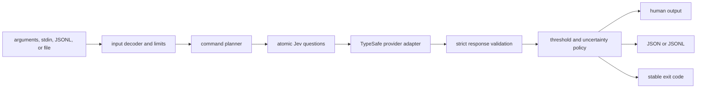
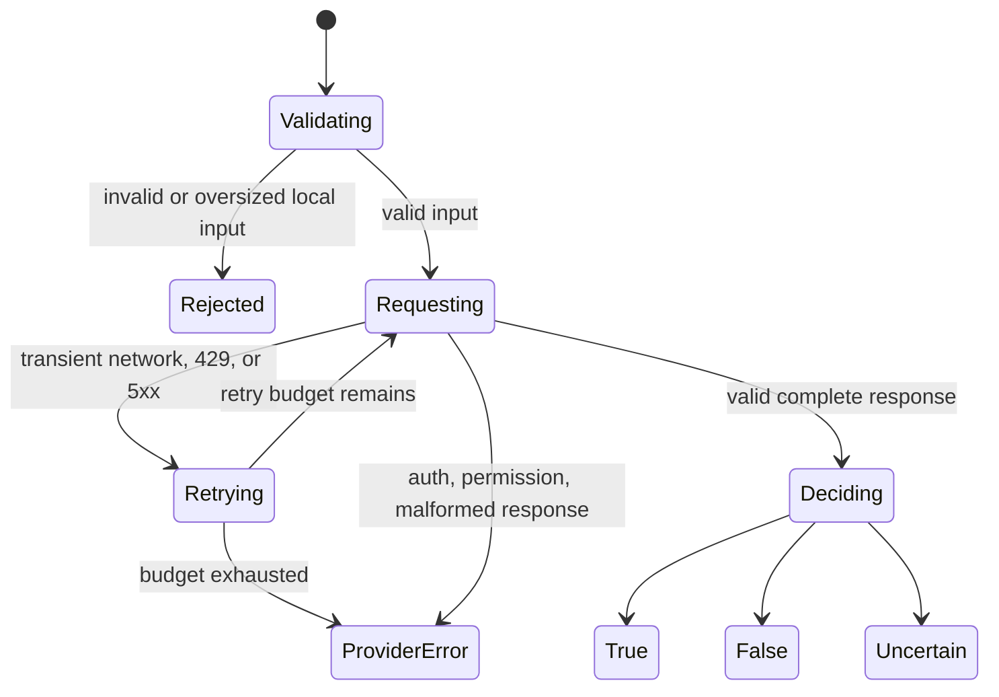

# Architecture

SemDecide turns text or structured records into typed semantic decisions that ordinary shell scripts and CI jobs can consume.

## Design rule

Jev makes narrow semantic judgments. SemDecide validates and exposes them. Caller-owned code decides whether any real-world side effect occurs.

## Boundaries

### Input boundary

The input layer owns:

- selecting exactly one input source
- UTF-8 decoding
- JSON and JSONL validation
- byte and record limits
- field selection for structured records
- preserving input order

Invalid local input must fail before a provider call.

### Provider boundary

The provider adapter owns:

- credential loading
- request serialization
- bounded timeout and transient retry behavior
- HTTP error classification
- response decoding
- strict answer-type and completeness validation
- redaction-safe errors

A provider failure is never equivalent to a semantic `false` result.

### Decision boundary

Each command owns local policy:

- `is` maps a Noul probability into true, false, or uncertain.
- `choose` preserves the selected option, all probabilities, and confidence.
- `score` preserves the score, legend, probabilities, and confidence.
- `filter` maps one predicate over ordered records and returns matching records.
- `guard` composes multiple Jev signals through deterministic safety rules.

Thresholds and minimum confidence values are explicit local inputs.

## Failure states

## Public contracts

Machine output includes a schema version. Removing or renaming a field, changing JSONL enrichment, or changing an exit code requires a major version unless a compatibility path is provided.

Provider responses are untrusted external data. Every expected field and numeric range must be validated before rendering or policy evaluation.

## Privacy and cost

Input sent to Jev leaves the local machine. SemDecide should make that boundary clear, cap accidental payload size, expose usage returned by Jev, and avoid implicit persistent caching.

## Non-goals

SemDecide is not an authorization system, an agent executor, a sandbox, an observability backend, or a security proof. It is a small semantic decision layer designed to compose with those systems.
