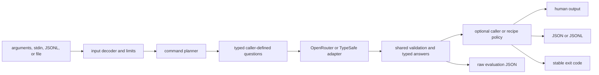
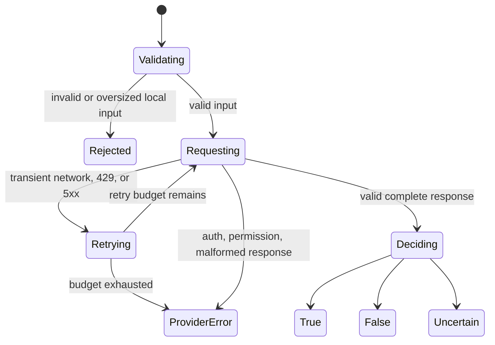

# Architecture

SemDecide turns text or structured records into typed semantic decisions that ordinary shell scripts and CI jobs can consume.

## Design rule

Jev makes narrow semantic judgments. SemDecide validates and exposes them. Caller-owned code decides whether any real-world side effect occurs.

## Core and applications

- `questions.py` defines strict Pydantic Noul, Choice, and Score questions and the `EvaluationRequest` schema.
- `evaluation.py` exposes `evaluate(state=..., questions=..., evaluator=...)`, validates requests before dispatch, and returns typed answers with usage and latency. It has no domain-specific prompts or policy.
- `models.py` defines primitive answers, evaluation results, and compatibility command result models.
- `commands.py` composes the public API for `is`, `choose`, `score`, and `filter`.
- `recipes/guard.py` owns the guard prompts, thresholds, decisions, and failure policy. It consumes the same public API available to external users.
- `recipes/__init__.py` validates declarative JSON question sets and resolves explicit paths or local/user-wide names. It never loads executable plugins.
- `client.py` preserves the legacy guard client behavior. Guard policy lives only in `recipes/guard.py`; there is no separate `policy.py`. Compatibility exports of guard models are lazy; normal core imports do not import the guard recipe.

`evaluate --request` accepts dynamically generated requests, including agent-generated JSON. Recipes are optional. JSON recipes reuse questions but do not introduce a rule language; custom interpretation lives in caller-owned Python or downstream code. See [recipes.md](recipes.md).

## Boundaries

### Input boundary

The input layer owns:

- selecting exactly one input source
- UTF-8 decoding
- JSON and JSONL validation
- byte and record limits
- field selection for structured records
- preserving input order

Invalid local input must fail before a provider call.

### Provider boundary

The provider adapter owns:

- credential loading
- request serialization
- bounded timeout and adapter-specific retry behavior (TypeSafe retries; OpenRouter makes one attempt)
- HTTP error classification
- response decoding
- strict answer-type and completeness validation
- redaction-safe errors

A provider failure is never equivalent to a semantic `false` result.

### Decision boundary

The primitive evaluation API returns answers, not an application verdict. `evaluate` and declarative recipe runs exit successfully for any valid evaluation, including low probabilities or confidence. Existing command and guard policy stays outside the core:

- `is` maps a Noul probability into true, false, or uncertain.
- `choose` preserves the selected option, all probabilities, and confidence.
- `score` preserves the score, legend, probabilities, and confidence.
- `filter` maps one predicate over ordered records and returns matching records.
- `guard` composes multiple Jev signals through deterministic safety rules.

Thresholds and minimum confidence values are explicit local inputs.

## Failure states

The retry branches below apply to TypeSafe; OpenRouter makes one attempt. Primitive evaluation returns success after a valid complete response, without the final true/false/uncertain policy step.

## Public contracts

Machine output includes a schema version. Removing or renaming a field, changing JSONL enrichment, or changing an exit code requires a major version unless a compatibility path is provided.

Provider responses are untrusted external data. Every expected field and numeric range must be validated before rendering or policy evaluation.

## Privacy and cost

Input sent to Jev leaves the local machine. SemDecide should make that boundary clear, cap accidental payload size, expose usage returned by Jev, and avoid implicit persistent caching.

## Non-goals

SemDecide is not an authorization system, an agent executor, a sandbox, an observability backend, or a security proof. It is a small semantic decision layer designed to compose with those systems.
