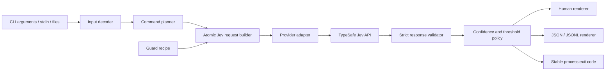

# SemDecide v0.2: Semantic decisions for Unix and CI

## One-line outcome

A developer can pipe text or JSON into `semdecide` and receive a typed, confidence-aware semantic predicate, choice, score, or filtered stream that is safe to compose in shell scripts and CI.

## Why this replaces the original product thesis

SemDecide's original action-firewall prototype is technically valid but is not the strongest standalone product. Cordum and several smaller projects already position themselves as agent action firewalls with approval workflows, policy engines, dashboards, and audit logs. Rebuilding that control plane would put SemDecide in a crowded, operationally heavy category where Jev is only one internal component.

Jev's differentiated capability is broader: cheap, fast, typed judgments (`Noul`, `Choice`, and `Score`) over arbitrary state, with many isolated questions evaluated in parallel. SemDecide should expose that capability as a small composable developer primitive. The existing agent guard remains as a built-in recipe and proof of composition rather than the entire product.

Positioning: **SemDecide is `jq` for judgment.**

## Prior art and evidence

- TypeSafe documents Jev as a machine-native decision model, not a chatbot. It returns typed values, probabilities, and confidence.
- TypeSafe's official patterns emphasize atomic questions, code-owned control flow, confidence routing, parallel questions, semantic search, semantic linting, and high-volume map-reduce.
- A live mixed-record experiment evaluated six records plus a route and severity in one call. It correctly separated routine records from account-takeover and churn signals, returned an intentionally uncertain route for a secret-exposure case, and scored the urgent customer case `2.96/3` with `0.96` confidence.
- A live semantic-code experiment selected the credential-ingress snippet with probability `1.0`, detected fail-closed handling at `0.83`, and correctly judged that the small excerpt did not prove a comprehensive security posture.
- GitHub landscape research found a mature action firewall in Cordum and many emerging agent-policy projects. Natural-language grep projects exist, but the observed projects are small and primarily embedding/index based. A universal typed decision pipe using predicate, choice, score, confidence, and CI semantics remains a sharper wedge.
- Broad evaluation is not the wedge. Promptfoo and DeepEval already cover full LLM evaluation suites. SemDecide focuses on one-shot semantic decisions inside ordinary developer workflows.

## Parameter table

| Parameter | Value | Confidence | How determined |
|---|---|---:|---|
| Who it is for | Developers, platform engineers, security engineers, and agent builders who already use shell pipelines or CI and need semantic checks without building an LLM evaluation stack | verified | Existing CLI workflow, competitor landscape, Jev official patterns |
| Recurring pain | Exact string rules cannot express meaning; general LLM calls are slow, verbose, expensive, and awkward to turn into stable process control | verified | Jev positioning and successful live mixed-record/code experiments |
| Success condition | In under five minutes, a new user installs SemDecide and uses stdin or a file to run a predicate, route among choices, score a rubric, and filter JSONL; machine output and exit codes compose correctly in CI | verified | Directly testable public-interface target |
| Explicitly NOT doing | Agent execution, identity/authentication, human approval UI, sandboxing, a hosted control plane, prompt generation, general chat, full eval dashboards, vector indexing | verified | Competitive analysis and scope reduction |
| Product identity | Keep the `SemDecide` name and use `semdecide` as the primary executable. Retain `reflex` only as a temporary compatibility alias and the original guard as a recipe | assumed | Name is already implemented and fits fast System One decisions; reversible |
| Stack/runtime | Python 3.10+, standard library runtime, `argparse`, provider adapter abstraction, HTTP Jev adapter by default | verified | Existing zero-dependency package and portability requirement |
| Provider | TypeSafe Jev default; provider boundary designed so test doubles and future compatible evaluators can be added without changing command semantics | verified | Jev is the available differentiated backend; adapter avoids hard-coding transport into CLI |
| Inputs | Argument string, stdin text, JSON value, JSONL records, and files; explicit input mode when ambiguity exists | verified | Unix composability requirement |
| Core commands | `is`, `choose`, `score`, `filter`; retain `guard` as a recipe/compatibility surface | verified | Maps one-to-one to Jev primitives plus the validated record workflow |
| Deferred command | `find` over directories and large documents | verified | Valuable, but chunking, ignore rules, binary detection, and result provenance would bloat v0.2 |
| Output modes | Human-readable default; stable JSON with schema version; JSONL for streaming/filter output; quiet mode for exit-code-only use | verified | CI and pipeline integration requirements |
| Exit contract | `0` predicate true/success, `1` predicate false/no selected records, `2` local usage/input error, `3` uncertain result, `4` provider unavailable/invalid response | assumed | Mirrors grep where possible while representing uncertainty and provider failure distinctly |
| Uncertainty policy | Never silently coerce low confidence into true/false. `--min-confidence` controls the uncertain boundary; raw probability/confidence always available in machine output | verified | Live route result had only `0.27` confidence despite close probabilities |
| Threshold policy | `is` and `filter` default probability threshold `0.70`; configurable per invocation; thresholds are code-owned, not provider verdicts | assumed | Official cookbook uses calibrated thresholds but requires workflow tuning |
| Batching | Batch independent record predicates into one Jev request up to configurable limits; preserve input order and IDs | verified | Official parallel-question pattern and live six-record experiment |
| Cost controls | `--max-input-bytes`, `--max-records`, request preview, usage reporting, and no hidden retries on non-idempotent local output | verified | Cloud API spend and accidental large-input risk |
| Privacy | Clear warning that submitted content leaves the machine for TypeSafe; never log API keys; optional redaction hook is deferred | verified | External provider boundary |
| Credentials | `TYPESAFE_API_KEY`, then the existing mode-600 credentials file; no secrets in CLI arguments or config output | verified | Existing validated storage and helper behavior |
| Retries/timeouts | Bounded connect/read timeout, retry only transient status/network failures with capped exponential backoff and jitter | verified | Production integration failure modes and official SDK retry docs |
| Caching | Off by default; optional content-addressed local cache with explicit TTL and mode-600 storage is deferred to v0.3 | assumed | Privacy and stale-decision risks outweigh initial speed benefit |
| Distribution | PyPI-ready wheel/sdist, `pipx install`, `uv tool install`, source install; GitHub Actions CI on Python 3.10-3.13 | verified | Open-source CLI acceptance path |
| License | MIT | verified | Existing repository license |
| Auth model | Local API key only; no user accounts or hosted service | verified | Explicit non-goal |
| Deploy target | PyPI and GitHub Releases after repository publication; no server deployment | assumed | User requested open source; publishing externally remains separately approved |
| Budget | Keep runtime dependency-free and v0.2 small enough to independently understand and audit | verified | Product wedge and OSS adoption goal |
| Irreversible decisions | None in the local build. Repository publication, package-name reservation, and PyPI release require explicit approval before external action | verified | External publication is reversible only with reputational/package consequences |
| Acceptance check | Fresh-venv install plus live Jev runs for every command, deterministic fixture tests, malformed input, low-confidence routing, timeout, HTTP errors, partial/missing response, JSON schema, JSONL ordering, limits, wheel/sdist, and secret scan | verified | Maps every public output and integration boundary to observable behavior |

## Public interface

### Predicate

```bash
printf '%s' 'Login from a new country, then payout details changed.' \
  | semdecide is 'This describes a plausible account takeover'
```

Human output includes verdict, probability, and model confidence. Machine mode:

```bash
... | semdecide is '...' --json
```

```json
{
  "schema_version": "1",
  "command": "is",
  "verdict": "true",
  "probability": 0.86,
  "confidence": null,
  "threshold": 0.7,
  "model": "jev-1.13.0",
  "usage": {"input_tokens": 120, "output_tokens": 8}
}
```

Noul currently provides probability but not a separate confidence field, so `confidence` is nullable and uncertainty for predicates is represented by a configurable probability margin around the threshold.

### Choice and routing

```bash
cat ticket.txt | semdecide choose \
  --option support='ordinary support request' \
  --option security='possible security incident' \
  --option billing='billing or payment issue'
```

### Score

```bash
cat response.txt | semdecide score \
  --level 'unsafe or misleading' \
  --level 'mostly correct but incomplete' \
  --level 'correct, grounded, and complete'
```

### JSONL filtering

```bash
cat tickets.jsonl | semdecide filter \
  'The record indicates urgent churn risk or active customer impact' \
  --field text --threshold 0.70 --jsonl
```

Input order and original records are preserved. Matching output records gain a namespaced `_semdecide` metadata object unless `--raw` is selected.

### Agent guard recipe

```bash
semdecide guard \
  --action 'Delete the production database' \
  --context 'No exact approval or backup exists'
```

The old `semdecide check` command remains as a deprecated alias for one minor release.

## Architecture



### Modules

- `models.py`: immutable request/result domain types and schema version.
- `inputs.py`: stdin/file/text/JSON/JSONL decoding and size limits.
- `providers/base.py`: provider protocol.
- `providers/typesafe.py`: Jev HTTP transport, credentials, retries, strict response parsing.
- `commands.py`: predicate, choice, score, and filter request planning.
- `policy.py`: deterministic guard policy and fail-closed provider behavior.
- `cli.py`: argument parsing, rendering, and exit-code mapping.

## Build order

1. Preserve and tag the existing action-firewall prototype in git history.
2. Introduce domain types, strict provider response validation, timeout/retry behavior, and injectable transport.
3. Implement common input decoding, byte/record limits, output schema, and exit contract.
4. Implement `is`, then validate live and with fixtures.
5. Implement `choose` and `score`, then validate all confidence and malformed-response branches.
6. Implement batched JSONL `filter` with order preservation and partial-failure behavior.
7. Move existing action policy to `guard`; retain `check` as a deprecated alias.
8. Add open-source project files: contribution guide, security policy, code of conduct, changelog, issue templates, CI, release build, and architecture docs.
9. Build wheel and sdist, install into fresh environments, and run the complete live acceptance matrix.
10. Independently review the diff before any external publication.

## Acceptance checks

| Requirement | Observable check |
|---|---|
| Installability | Build wheel and sdist; install each into separate clean virtual environments; `semdecide --version` and all command help pages return 0 |
| Predicate true | Pipe an account-takeover narrative; `semdecide is ... --json` returns `verdict=true` and exit 0 |
| Predicate false | Pipe a routine backup message; the same criterion returns `verdict=false` and exit 1 |
| Predicate uncertainty | Fixture probability inside the configured margin returns `verdict=uncertain` and exit 3 |
| Choice | Mixed support ticket routes to the expected named option and returns all probabilities |
| Choice confidence | Low provider confidence is preserved and triggers exit 3 when below `--min-confidence` |
| Score | Urgent churn case scores in the highest level with legend and probabilities preserved |
| Filter | Six-record JSONL fixture returns exactly the expected three records, in original order, with `_reflex` metadata |
| Empty filter | No matches emits no JSONL records and exits 1 |
| Input safety | Empty input, malformed JSON/JSONL, missing field, oversized input, too many records, binary file, and conflicting input modes return exit 2 without an API call |
| Provider auth | Missing key and HTTP 401 return exit 4 without exposing the key |
| Provider resilience | Timeout, connection refusal, HTTP 429/500, invalid JSON, missing answer, wrong answer type, and partial batch response return documented exit 4 behavior; transient retries are bounded |
| Privacy | Human and machine errors redact authorization headers and API key values; secret scan over repository and captured outputs finds no key |
| Compatibility | Existing `semdecide check` behavior remains correct and emits a deprecation warning to stderr |
| Packaging | Runtime package has no undeclared dependencies, includes license/readme/type marker, and works under Python 3.10-3.13 |
| CI | Lint/type/test/build jobs pass on a clean checkout with live tests opt-in only |
| Documentation | README quickstart can be executed verbatim in a fresh environment |

## Known risks

1. **Thresholds are domain-specific.** Defaults are convenience values, not universal guarantees. Output must make probabilities visible and docs must teach calibration.
2. **Jev is a hosted dependency.** Offline operation is impossible in v0.2. Provider errors must be distinct from semantic false results.
3. **Cloud privacy boundary.** Users may pipe sensitive data. Warnings, explicit limits, and documentation are mandatory.
4. **A thin wrapper is easy to copy.** The OSS advantage comes from excellent Unix semantics, stable schemas, recipes, calibration tooling, and integrations, not proprietary code.
5. **Choice competition.** Adding too many options changes probability distribution. The CLI must document Jev's 255-option limit and encourage narrow choices.
6. **Question quality matters.** SemDecide cannot make vague or compound criteria reliable. Documentation and validation should encourage one atomic judgment per invocation.
7. **Naming is a release boundary.** `semdecide` was available on PyPI and avoids the established Reflex web-framework CLI collision. Repository and package publication still require final availability checks.

## Explicit non-goals

- Replacing OPA, Cedar, IAM, or deterministic authorization.
- Claiming that semantic judgments are security proofs.
- Executing agent tools or shell commands.
- Building a hosted dashboard or collecting user data.
- Supporting arbitrary LLM providers in v0.2.
- Indexing entire repositories or implementing vector search.
- Hiding probabilities behind a single opaque pass/fail result.
